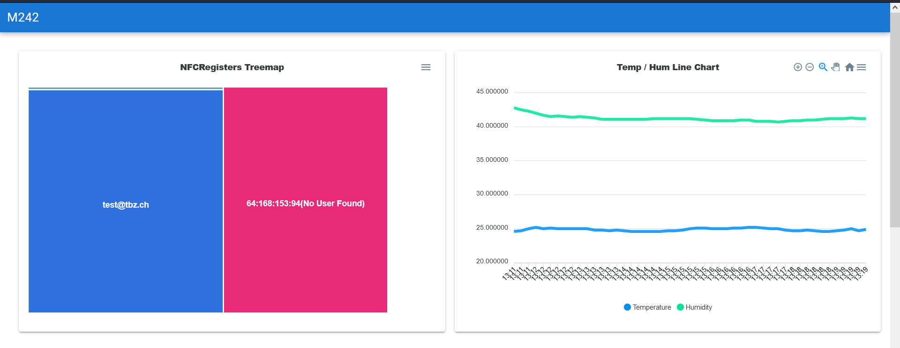
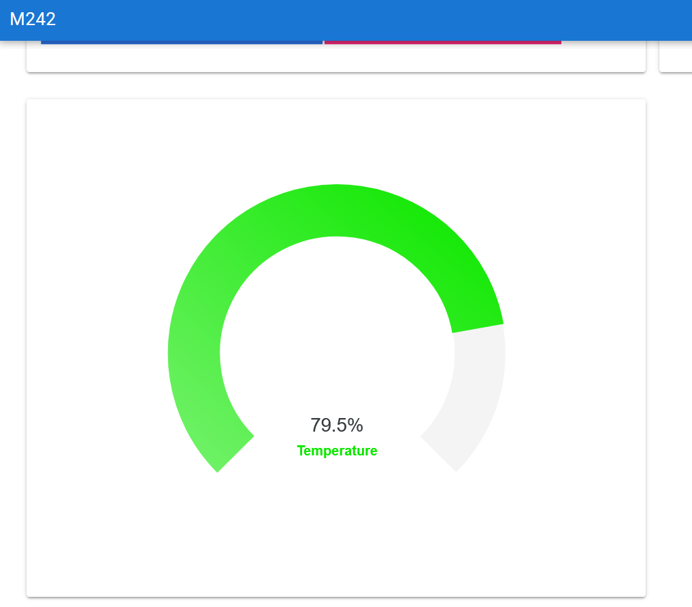
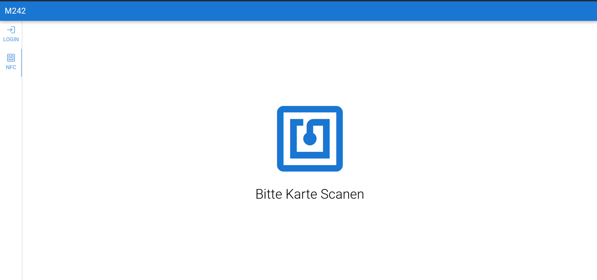
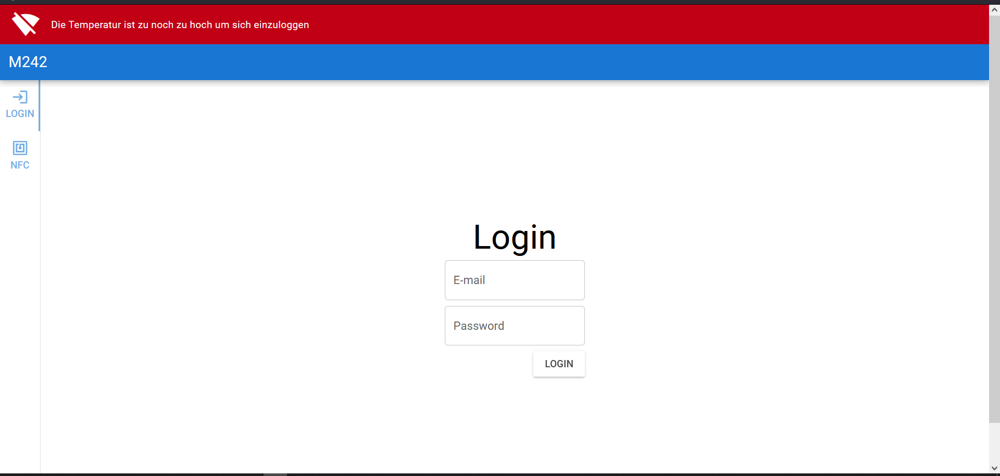

# M242-Mikroprozessoren


Unsere Projektidee besteht aus 3 unterschiedlichen Aspekten und simuliert die Sicherheitsvorkehrung einer Schleuse die zu extremen Temperaturen führt. 
Dabei liefern 2 IoT-Kits die benötigten Daten: Das eine liefert die Umliegende Temperatur, das andere die Informationen einer Keycard, die an den Sensor geführt wird. Würden Anomalien auftreten die zu sehr hohem Temperatur Unterschied führen würden zwischen den 2 IoT-Kits, würde der Zugang mit der Keycard verweigert werden.

#Quick Start

Die Installation ist einfach, das Projekt zu sich herunterladen via git clone.
```git clone https://github.com/Michi202/M242-Mikroprozessoren.git```

Danach im MBED Studio jeweils auf einem der beiden IoT-Kits aufsetzen und kompilieren. Die Seite wird via localhost gehostet.
Alle Geräte müssen sich im selben Netzwerk befinden und die IP-Adresse des WebApp-Gerätes muss den Kits bekannt sein.

#References  
[SendNFC](SendNFC/README.md)  
[sendTemperature](sendTemperature/README.md)  
[WebApp](WebApp/README.md)  

**Ablauf**

Der User begibt sich auf das Eingabeformular und gibt seine Login-Daten ein. Danach wird er dazu aufgefordert, seine Key-Card an den Sensor zu halten. Ist die Temperatur auserhalb des vorgegebenen Limits, so erlaubt ihm der Login keinen Zugriff. Ist die Temperatur jedoch passabel, so wird er auf eine Seite weitergeleitet, die unterschiedliche Statistiken anzeigt (anzahl Logins, Temperaturen, usw.). Im "ernsten" Anwendungsfall würde sich dann die Türe öffnen.

**Aufteilung**

Da Severin Senn sich mit C# und vue.js mehr auf Seiten WebApp auskennt, hat er diese Aufgabe übernommen, wärend der Rest sich mit C++ und den IoT-Kits auseinandergesetzt hat. Jedoch haben wir uns auch untereinander Ausgeholfen und gemeinsam schwierigere Probleme behoben, sei es bei den Kits oder der WebApp.

#Demo



